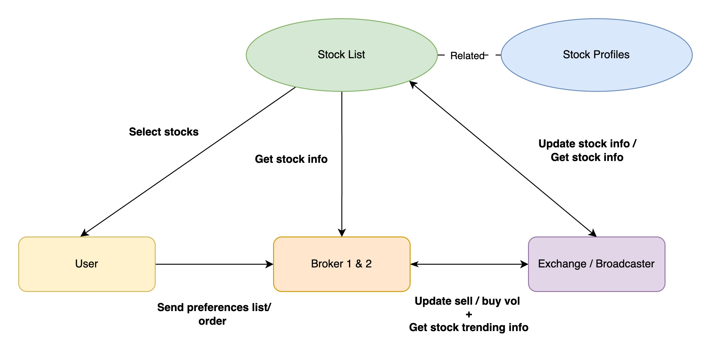

# Overview
A mini project using rust to build a stock simulation system

## Hands on tools 
- rust
- rabbitmq
- amiquip (crates)

# Flowchart

    

# File structure 
| Files  | Overview |
| ------------- | ------------- |
| /src/bin/stock.rsl  | This file store the user threads and exchanges threads. All the action such as generating new stock request order, update stock price, update stock trends info will be defined and carry out in this file. |
| /src/bin/broker1.rs  | This is files that store the first broker in these simulations system. This file will be linked to the stock.rs via RabbitMQ protocol tools and Amiquip library. Action such as purchasing order (based on the user preferences), selling stocks, and sending buy or sell volumes of the stock back to the exchange threads. |
| /src/bin/broker2.rs  | This is the files that store the second broker in this simulation system. Action will be like the broker1.rs files. |

# Background studies

## Overview of latency and througput result

# Findings

 
There are also limitation founded out on the Rust language which is inconsistent compiling time and this also been mentioned by many other researchers (Bang et al., 2023; Chen et al., 2023). The scheduling flow might be disrupted by issues such as delays in compiling time or execution time, particularly in scenarios where strict timing constraints are involved. For instance, consider a situation where brokers expect to receive an order list within a maximum timeframe of 2 seconds. Despite both the exchange and broker functionalities being executed concurrently, delays in compiling or executing the exchange threads (as defined in the stock.rs file) could potentially cause the order list not to be sent to the brokers within the expected timeframe. Such disruptions highlight the importance of optimizing performance and minimizing latency in systems where timely communication and coordination are critical.

# 